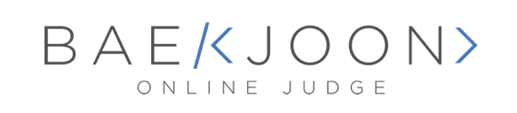

<div align="center">

  
  <h1>Baekjoon</h1>
  
  <p>
    AP's Baekjoon Solution Codes.
  </p>
  
  
<!-- Badges -->
<p>
  <a href="https://github.com/aptheparker/baekjoon/graphs/contributors">
    
  </a>
  <a href="">
    
  </a>
  <a href="https://github.com/aptheparker/baekjoon/network/members">
    
  </a>
  <a href="https://github.com/aptheparker/baekjoon/stargazers">
    
  </a>
  <a href="https://github.com/aptheparker/baekjoon/issues/">
    
  </a>
  <a href="https://github.com/aptheparker/baekjoon/blob/master/LICENSE">
    
  </a>
</p>
   
<h4>
    <a href="https://github.com/aptheparker/baekjoon/">View Demo</a>
  <span> · </span>
    <a href="https://github.com/aptheparker/baekjoon">Documentation</a>
  <span> · </span>
    <a href="https://github.com/aptheparker/baekjoon/issues/">Report Bug</a>
  <span> · </span>
    <a href="https://github.com/aptheparker/baekjoon/issues/">Request Feature</a>
  </h4>
</div>

<br />

<!-- Table of Contents -->
# :notebook_with_decorative_cover: Table of Contents

- [About the Project](#star2-about-the-project)
  * [Screenshots](#camera-screenshots)
  * [Tech Stack](#space_invader-tech-stack)
- [Getting Started](#toolbox-getting-started)
  * [Prerequisites](#bangbang-prerequisites)
  * [Installation](#gear-installation)
  * [Running Tests](#test_tube-running-tests)
  * [Run Locally](#running-run-locally)
- [Usage](#eyes-usage)
- [Contributing](#wave-contributing)
- [License](#warning-license)
- [Contact](#handshake-contact)
- [Acknowledgements](#gem-acknowledgements)

  

<!-- About the Project -->
## :star2: About the Project


<!-- Screenshots -->
### :camera: Screenshots

<div align="center"> 
  
</div>


<!-- TechStack -->
### :space_invader: Tech Stack

<details>
  <summary>Language</summary>
  <ul>
    <li>C++</li>
    <li>Python</li>
  </ul>
</details>

<!-- Getting Started -->
## 	:toolbox: Getting Started

<!-- Prerequisites -->
### :bangbang: Prerequisites

None

<!-- Installation -->
### :gear: Installation

None

<!-- Running Tests -->
### :test_tube: Running Tests

None

<!-- Run Locally -->
### :running: Run Locally

Clone the project

```bash
  git clone https://github.com/aptheparker/baekjoon.git
```

<!-- Usage -->
## :eyes: Usage

Baekjoon algorithms solutions available here. <br>
Whenever I send the solutions of each quesiton, the program would commit the source codes automatically to this respository. <br>
Have fun!!

<!-- Contributing -->
## :wave: Contributing

<a href="https://github.com/aptheparker/baekjoon/graphs/contributors">
  
</a>


Contributions are always welcome!

<ol>
  <li>Fork the Project</li>
  <li>Create your Feature Branch (git checkout -b feature/AmazingFeature)</li>
  <li>Commit your Changes (git commit -m 'Add some AmazingFeature')</li>
  <li>Push to the Branch (git push origin feature/AmazingFeature)</li>
  <li>Open a Pull Request</li>
</ol>

<!-- License -->
## :warning: License

None

<!-- Contact -->
## :handshake: Contact

Your Name - [@instagram](https://www.instagram.com/aptheparker) - aptheparker@gmail.com

Project Link: [https://github.com/aptheparker/baekjoon](https://github.com/aptheparker/me)


<!-- Acknowledgments -->
## :gem: Acknowledgements

None

